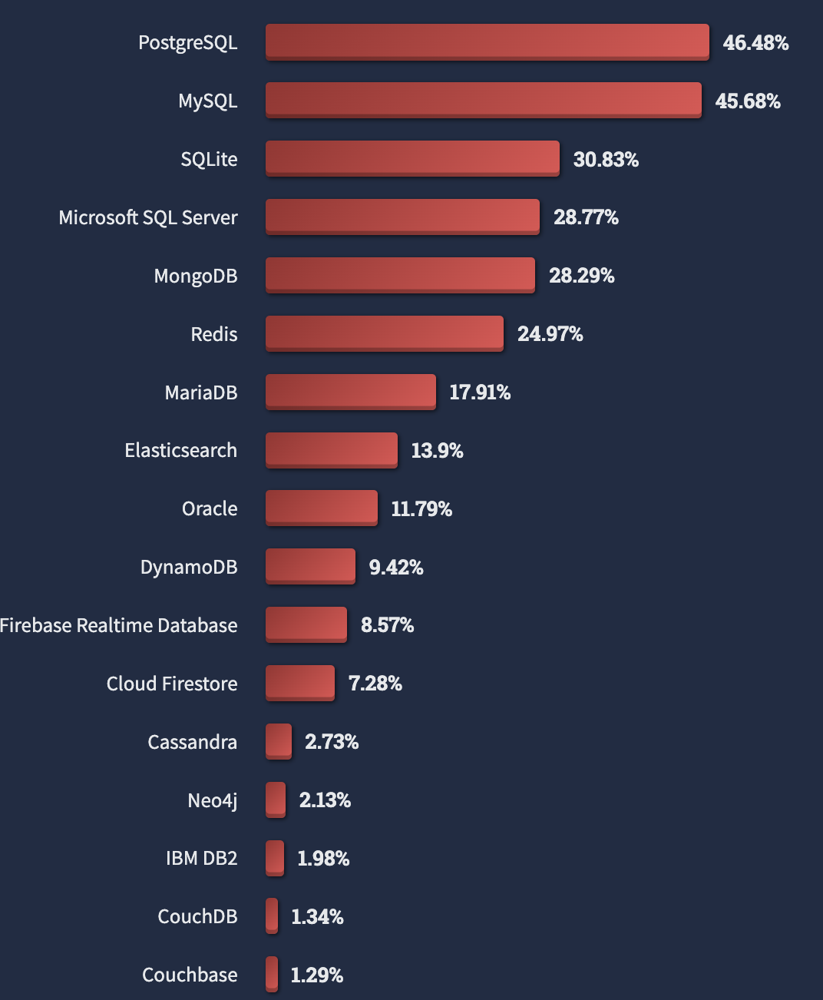

## MongoDB
MongoDB is a popular NoSQL database that is known for its flexibility and scalability. It's a great choice for storing and managing large amounts of data. Here are some key points about MongoDB:

- Document-Oriented: MongoDB stores data in a flexible, JSON-like format called BSON (Binary JSON), making it easy to work with structured and semi-structured data.

- Scalable: MongoDB is designed to scale horizontally, making it suitable for applications with high data volume and throughput requirements.

- mPython and MongoDB: You can interact with MongoDB using Python through libraries like PyMongo and MongoEngine.

Some alternatives for MongoDB is cassandra, couchdb, ravendb.

## MongoEngine
MongoEngine is an Object-Document Mapper (ODM) for MongoDB in Python. It provides a high-level, object-oriented API to work with MongoDB, making it easier to integrate MongoDB into your Python applications. Some key features of MongoEngine include:

- Simplified Data Modeling: Define your data models in Python classes, and MongoEngine will take care of the mapping between Python objects and MongoDB documents.

- Querying Made Easy: You can perform complex queries on your MongoDB data using a simple and intuitive syntax.

- Validation: MongoEngine provides built-in data validation and ensures that data stored in MongoDB adheres to the defined schema.

Certainly, let's explain how MongoDB works and compare document modeling in MongoDB to traditional Relational Database Management Systems (RDBMS).

## How Does MongoDB Work?

MongoDB is a NoSQL database management system that stores data in a flexible, document-based format known as BSON (Binary JSON). Here's how MongoDB works:

1. **Data Storage**: MongoDB stores data in collections, which are similar to tables in RDBMS. However, in MongoDB, collections contain documents instead of rows, and these documents are represented as JSON-like BSON objects.

2. **Document-Oriented**: MongoDB is a document-oriented database, meaning it stores data in documents. Each document can have a different structure, and fields can vary from one document to another, which provides a high degree of flexibility.

3. **Schema-less**: Unlike RDBMS, MongoDB is schema-less, allowing you to insert documents without a predefined schema. This flexibility makes it well-suited for projects where the data structure may evolve over time.

4. **Query Language**: MongoDB provides a powerful query language that allows you to retrieve, filter, and manipulate data in various ways. It supports complex queries, indexing, and aggregation for data analysis.

5. **Scalability**: MongoDB is designed for horizontal scalability, making it suitable for handling large amounts of data and high traffic. You can distribute your data across multiple servers or clusters to achieve scalability.

6. **Replication and Sharding**: MongoDB offers features like replication for data redundancy and sharding for distributing data across multiple servers, ensuring data availability and reliability.

## How Do We Model with Documents in MongoDB?

In MongoDB, data is modeled using documents. Here's how document modeling in MongoDB differs from the traditional relational model:

### RDBMS (Relational Database Management System) Model:

- **Tables**: In an RDBMS, data is organized into tables with fixed schemas. Each table contains rows, and each row represents a single entity or record. The structure of the tables is defined by a schema that specifies the data types and relationships between tables.

- **Normalization**: RDBMS encourages normalization, which means splitting data into separate tables to avoid data redundancy. Relationships between tables are established through foreign keys.

- **ACID Transactions**: RDBMS typically supports ACID (Atomicity, Consistency, Isolation, Durability) transactions, ensuring data consistency.

### MongoDB Document Model:

- **Collections**: In MongoDB, data is organized into collections, similar to tables in RDBMS. However, collections contain documents instead of rows. Each document can have a different structure and can include nested data structures.

- **No Fixed Schema**: MongoDB doesn't enforce a fixed schema, allowing you to insert documents with varying structures within the same collection. This flexibility is particularly useful for projects where data requirements change frequently.

- **Denormalization**: MongoDB encourages denormalization, which means embedding related data within a single document. This can improve query performance by reducing the need for joins.

- **Consistency Model**: MongoDB offers strong consistency on a single document level. However, achieving consistency across multiple documents or collections may require careful application design.

